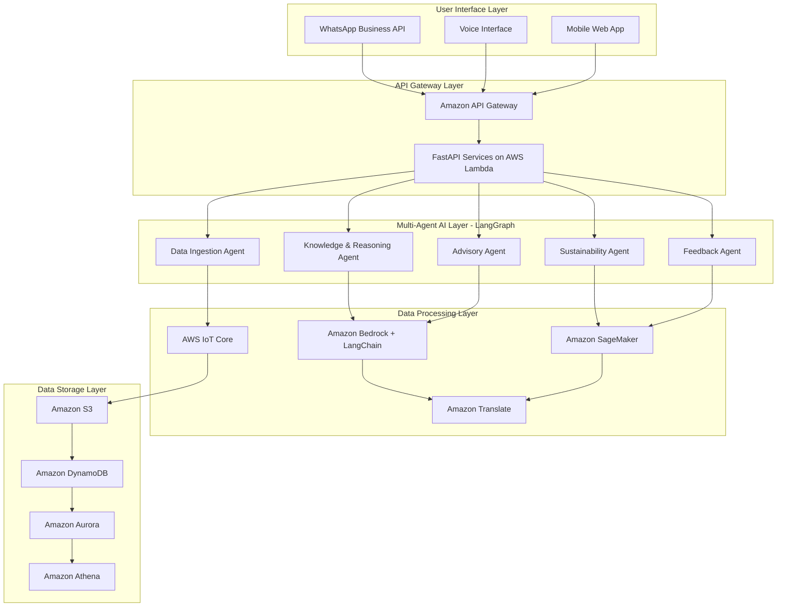

# Design Document: KrishiMitra Platform

## Overview

KrishiMitra is a production-ready, AI-powered agricultural advisory platform designed to serve rural farmers in India through intelligent, multilingual interfaces. The system leverages AWS cloud services to provide real-time agricultural intelligence, personalized recommendations, and sustainable farming guidance through voice and chat interactions.

The platform addresses critical challenges in rural agriculture by combining multi-agent AI systems, IoT sensor networks, satellite imagery analysis, and market intelligence to deliver actionable insights that improve crop yields, reduce input costs, and promote sustainable farming practices.

## Architecture

### High-Level Architecture

The KrishiMitra platform follows a microservices architecture deployed on AWS using Python-based services, organized into five primary layers:



### Multi-Agent System Architecture

The core intelligence of KrishiMitra is powered by five specialized AI agents built using LangGraph and LangChain that collaborate to provide comprehensive agricultural guidance:

**1. Data Ingestion Agent (LangGraph Node)**
- Collects real-time data from IoT sensors, weather APIs, satellite imagery, and market databases
- Uses LangChain tools for API integrations and data validation
- Normalizes and validates incoming data streams using Pydantic models
- Implements data quality checks and anomaly detection
- Stores processed data in appropriate storage systems

**2. Knowledge & Reasoning Agent (LangGraph Node)**
- Powered by LangChain integration with Amazon Bedrock (Claude 3.5 Sonnet)
- Processes agricultural knowledge bases and research papers using RAG
- Performs contextual analysis of farmer queries using LangChain chains
- Generates evidence-based recommendations with source attribution

**3. Advisory Agent (LangGraph Node)**
- Delivers personalized recommendations using LangChain decision trees
- Integrates outputs from other agents through LangGraph state management
- Handles multilingual communication through LangChain translation chains
- Maintains conversation context using LangChain memory components

**4. Sustainability Agent (LangGraph Node)**
- Monitors environmental impact using specialized LangChain tools
- Provides climate-resilient farming recommendations
- Tracks carbon footprint and biodiversity metrics
- Suggests organic and sustainable alternatives using knowledge graphs

**5. Feedback Agent (LangGraph Node)**
- Captures farmer feedback using LangChain structured output parsers
- Implements continuous learning algorithms with LangChain callbacks
- Updates recommendation models based on real-world results
- Identifies successful practices for knowledge sharing

## Components and Interfaces

### User Interface Components

**WhatsApp Integration**
- Built using AWS End User Messaging Social for WhatsApp Business API
- Handles text messages, voice notes, and image sharing
- Supports group conversations with context management
- Implements message queuing for high-volume scenarios

**Voice Processing System**
- Amazon Lex for natural language understanding
- Amazon Polly for text-to-speech in Indian languages
- Amazon Transcribe for speech-to-text conversion
- Custom voice compression for low-bandwidth optimization

**Mobile Web Interface**
- Progressive Web App (PWA) for offline capability
- Responsive design optimized for feature phones
- Cached content for intermittent connectivity
- Simple UI designed for low digital literacy

### Core Processing Components

**Multi-Agent Orchestrator (LangGraph)**
- Coordinates communication between specialized agents using LangGraph workflows
- Implements agent routing based on query type and context using conditional edges
- Manages agent state and conversation history through LangGraph state management
- Handles load balancing and failover scenarios with error handling nodes

**FastAPI Services**
- RESTful API endpoints built with FastAPI for high performance
- Automatic API documentation with OpenAPI/Swagger
- Pydantic models for request/response validation
- Async/await support for concurrent request handling
- Built-in dependency injection for service components

**Data Pipeline (Python)**
- AWS Glue ETL jobs written in Python for agricultural data processing
- Amazon Kinesis integration using boto3 for real-time data streaming
- AWS Step Functions with Python Lambda functions for workflow orchestration
- Amazon EventBridge integration for event-driven processing

**AI/ML Services Integration (LangChain)**
- LangChain Bedrock integration for foundation model access
- Custom LangChain tools for Amazon SageMaker model inference
- LangChain document loaders for agricultural knowledge bases
- Vector stores integration (FAISS/Chroma) for similarity search
- LangChain agents for complex reasoning workflows

### External Integrations

**IoT Sensor Network**
- AWS IoT Core for device connectivity
- AWS IoT Device Management for sensor fleet management
- AWS IoT Analytics for sensor data processing
- Support for soil moisture, pH, temperature, and humidity sensors

**Satellite Imagery Processing**
- Integration with Amazon SageMaker Geospatial capabilities
- Processing of Sentinel-2 and Landsat imagery
- NDVI and crop health analysis
- Field boundary detection and crop classification

**Government and Market Data**
- APIs for PM-KISAN, soil health card systems
- Integration with Agricultural Marketing Division (AGMARKNET)
- Weather data from India Meteorological Department
- Crop insurance database connectivity

## Data Models

### Core Data Entities

**Farmer Profile**
```json
{
  "farmerId": "string",
  "personalInfo": {
    "name": "string",
    "phoneNumber": "string",
    "preferredLanguage": "string",
    "location": {
      "state": "string",
      "district": "string",
      "village": "string",
      "coordinates": {
        "latitude": "number",
        "longitude": "number"
      }
    }
  },
  "farmDetails": {
    "totalLandArea": "number",
    "soilType": "string",
    "irrigationType": "string",
    "crops": [
      {
        "cropType": "string",
        "area": "number",
        "plantingDate": "date",
        "expectedHarvest": "date"
      }
    ]
  },
  "preferences": {
    "organicFarming": "boolean",
    "riskTolerance": "string",
    "budgetConstraints": "object"
  }
}
```

**Agricultural Intelligence Data**
```json
{
  "dataId": "string",
  "location": {
    "latitude": "number",
    "longitude": "number",
    "radius": "number"
  },
  "timestamp": "datetime",
  "weatherData": {
    "temperature": "number",
    "humidity": "number",
    "rainfall": "number",
    "windSpeed": "number",
    "forecast": "array"
  },
  "soilData": {
    "moisture": "number",
    "pH": "number",
    "nutrients": {
      "nitrogen": "number",
      "phosphorus": "number",
      "potassium": "number"
    }
  },
  "marketData": {
    "prices": "array",
    "demand": "object",
    "trends": "array"
  },
  "satelliteData": {
    "ndvi": "number",
    "cropHealth": "string",
    "growthStage": "string"
  }
}
```

**Recommendation Record**
```json
{
  "recommendationId": "string",
  "farmerId": "string",
  "timestamp": "datetime",
  "queryType": "string",
  "context": {
    "cropType": "string",
    "season": "string",
    "weatherConditions": "object"
  },
  "recommendation": {
    "title": "string",
    "description": "string",
    "actionItems": "array",
    "expectedOutcome": "string",
    "confidence": "number"
  },
  "feedback": {
    "implemented": "boolean",
    "effectiveness": "number",
    "comments": "string",
    "outcome": "object"
  }
}
```

### Data Storage Strategy

**Amazon DynamoDB Tables**
- FarmerProfiles: Farmer information and preferences
- Conversations: Chat history and context
- Recommendations: Advisory records and feedback
- SensorReadings: Real-time IoT sensor data

**Amazon S3 Buckets**
- agricultural-imagery: Satellite and drone images
- weather-data: Historical weather datasets
- market-data: Price and demand information
- model-artifacts: ML model files and training data

**Amazon Aurora Database**
- Transactional data for government scheme applications
- Market price history and analytics
- User authentication and authorization
- Audit logs and compliance records

## Correctness Properties

*A property is a characteristic or behavior that should hold true across all valid executions of a system—essentially, a formal statement about what the system should do. Properties serve as the bridge between human-readable specifications and machine-verifiable correctness guarantees.*

Before defining the correctness properties, I need to analyze the acceptance criteria from the requirements document to determine which ones are testable as properties.

### Property 1: Multi-source data ingestion and normalization
*For any* combination of IoT sensor data, satellite imagery, weather API data, market prices, and government database information, the Data_Ingestion_Agent should successfully collect and normalize all available data sources into a consistent format
**Validates: Requirements 1.1**

### Property 2: Agricultural intelligence generation
*For any* raw agricultural dataset, the Knowledge_Agent should analyze the data and generate contextual insights using LLM capabilities
**Validates: Requirements 1.2**

### Property 3: Personalized recommendation delivery
*For any* farmer query and processed agricultural intelligence, the Advisory_Agent should provide personalized recommendations based on the farmer's profile and current conditions
**Validates: Requirements 1.3**

### Property 4: Environmental impact assessment
*For any* environmental factor change (weather, soil conditions, climate data), the Sustainability_Agent should assess climate risks, water usage impacts, and soil health implications
**Validates: Requirements 1.4**

### Property 5: Continuous learning from feedback
*For any* farmer interaction and outcome data, the Feedback_Agent should capture the information and use it to improve future recommendation accuracy
**Validates: Requirements 1.5**

### Property 6: Multilingual speech recognition
*For any* audio input in Hindi, Tamil, Telugu, Bengali, Marathi, Gujarati, or Punjabi, the Voice_Interface should accurately convert speech to text
**Validates: Requirements 2.1**

### Property 7: Multilingual speech synthesis
*For any* text response and farmer's preferred language, the Voice_Interface should convert the text to natural-sounding speech in the specified language
**Validates: Requirements 2.2**

### Property 8: Voice recognition error handling
*For any* voice recognition failure scenario, the Voice_Interface should provide fallback options and request clarification from the farmer
**Validates: Requirements 2.3**

### Property 9: Low-bandwidth voice processing
*For any* network condition with bandwidth below optimal levels, the Voice_Interface should maintain functionality through compressed audio processing
**Validates: Requirements 2.4**

### Property 10: Dynamic language switching
*For any* conversation where a farmer switches languages mid-interaction, the Voice_Interface should adapt seamlessly to the new language
**Validates: Requirements 2.5**

### Property 11: Location-specific weather accuracy
*For any* farmer location request, the KrishiMitra_Platform should provide weather forecasts accurate to within 5 kilometers of the specified coordinates
**Validates: Requirements 3.1**

### Property 12: Fresh soil data delivery
*For any* soil condition query, the KrishiMitra_Platform should deliver soil moisture, pH, and nutrient data that was updated within the last 24 hours
**Validates: Requirements 3.2**

### Property 13: Nearby market price availability
*For any* market information request, the KrishiMitra_Platform should provide current crop prices from government mandis and private markets within 50 kilometers
**Validates: Requirements 3.3**

### Property 14: Satellite imagery crop analysis
*For any* available satellite imagery of a farmer's fields, the KrishiMitra_Platform should analyze crop health and growth patterns specific to those fields
**Validates: Requirements 3.4**

### Property 15: Relevant scheme notification
*For any* farmer profile and available government schemes, the KrishiMitra_Platform should identify and notify farmers of applicable subsidies and programs
**Validates: Requirements 3.5**

### Property 16: Comprehensive farmer profile creation
*For any* field information provided by a farmer, the Advisory_Agent should create and maintain a comprehensive Farmer_Profile including land size, soil type, water availability, and historical crop data
**Validates: Requirements 4.1**

### Property 17: Context-aware crop recommendations
*For any* crop selection request with local climate, soil conditions, and market demand data, the Advisory_Agent should recommend suitable crops based on all available factors
**Validates: Requirements 4.2**

### Property 18: Water-efficient irrigation guidance
*For any* irrigation guidance request, the Advisory_Agent should provide water scheduling recommendations that reduce usage by at least 20% while maintaining crop health
**Validates: Requirements 4.3**

### Property 19: Organic-prioritized pest management
*For any* reported pest or disease issue, the Advisory_Agent should suggest integrated pest management solutions that prioritize organic and sustainable methods
**Validates: Requirements 4.4**

### Property 20: Chemical-reducing fertilizer recommendations
*For any* fertilizer application planning request, the Advisory_Agent should recommend optimal timing and quantities that reduce chemical inputs by at least 15%
**Validates: Requirements 4.5**

### Property 21: Low-bandwidth functionality maintenance
*For any* network condition with bandwidth below 64 kbps, the KrishiMitra_Platform should compress data transmissions and maintain core functionality
**Validates: Requirements 5.1**

### Property 22: Offline critical information access
*For any* intermittent internet connectivity scenario, the KrishiMitra_Platform should cache critical information locally for offline access
**Validates: Requirements 5.2**

### Property 23: Adaptive voice compression
*For any* voice data transmission, the KrishiMitra_Platform should use adaptive compression to maintain quality while minimizing bandwidth usage
**Validates: Requirements 5.3**

### Property 24: Quality-preserving image compression
*For any* shared image, the KrishiMitra_Platform should automatically resize and compress the image without losing diagnostic quality
**Validates: Requirements 5.4**

### Property 25: Automatic data synchronization
*For any* connectivity restoration after an outage, the KrishiMitra_Platform should automatically synchronize cached data and pending requests
**Validates: Requirements 5.5**

### Property 26: WhatsApp response time compliance
*For any* WhatsApp message sent to the KrishiMitra number, the platform should respond with relevant agricultural advice within 30 seconds
**Validates: Requirements 6.1**

### Property 27: WhatsApp image analysis
*For any* crop photo shared via WhatsApp, the KrishiMitra_Platform should analyze the image and provide diagnostic feedback
**Validates: Requirements 6.2**

### Property 28: WhatsApp voice message processing
*For any* voice message sent via WhatsApp, the KrishiMitra_Platform should process the speech and respond with voice or text as appropriate
**Validates: Requirements 6.3**

### Property 29: WhatsApp message formatting
*For any* information request through WhatsApp, the KrishiMitra_Platform should format responses appropriately for WhatsApp's message length limitations
**Validates: Requirements 6.4**

### Property 30: Group chat context management
*For any* group conversation on WhatsApp with multiple farmers, the KrishiMitra_Platform should handle all participants while maintaining individual context for each farmer
**Validates: Requirements 6.5**

### Property 31: Water usage monitoring and alerting
*For any* tracked irrigation pattern, the Sustainability_Agent should monitor water usage and alert farmers when usage exceeds sustainable thresholds
**Validates: Requirements 7.1**

### Property 32: Organic alternative prioritization
*For any* chemical input recommendation request, the Sustainability_Agent should prioritize organic alternatives and minimize synthetic pesticide usage
**Validates: Requirements 7.2**

### Property 33: Comprehensive soil health tracking
*For any* soil health assessment, the Sustainability_Agent should track soil organic matter, erosion risk, and biodiversity indicators
**Validates: Requirements 7.3**

### Property 34: Climate risk early warning
*For any* detected climate risk, the Sustainability_Agent should provide early warnings for extreme weather events and adaptation strategies
**Validates: Requirements 7.4**

### Property 35: Carbon footprint calculation
*For any* farming activity data, the Sustainability_Agent should measure and report greenhouse gas emissions from those activities
**Validates: Requirements 7.5**

### Property 36: Regional market price availability
*For any* market price request, the KrishiMitra_Platform should provide real-time prices from government mandis and private markets within 100 kilometers
**Validates: Requirements 8.1**

### Property 37: Price trend analysis with forecasting
*For any* price trend analysis request, the KrishiMitra_Platform should display 30-day price history and 7-day forecasts for relevant crops
**Validates: Requirements 8.2**

### Property 38: Seasonal demand prediction
*For any* available demand pattern data, the KrishiMitra_Platform should predict seasonal demand fluctuations to guide planting decisions
**Validates: Requirements 8.3**

### Property 39: Net return calculation with logistics
*For any* transportation cost consideration, the KrishiMitra_Platform should calculate net returns after accounting for logistics to different markets
**Validates: Requirements 8.4**

### Property 40: Contract farming connection
*For any* existing contract farming opportunity, the KrishiMitra_Platform should connect farmers with verified buyers and fair-price contracts
**Validates: Requirements 8.5**

### Property 41: Feedback-driven recommendation adjustment
*For any* farmer feedback on recommendations, the Feedback_Agent should record outcomes and adjust future advice accordingly
**Validates: Requirements 9.1**

### Property 42: Yield correlation for accuracy improvement
*For any* reported crop yield, the Feedback_Agent should correlate results with provided recommendations to improve accuracy
**Validates: Requirements 9.2**

### Property 43: Seasonal pattern recognition and incorporation
*For any* emerging seasonal pattern, the Feedback_Agent should identify local trends and incorporate them into future predictions
**Validates: Requirements 9.3**

### Property 44: Successful technique knowledge sharing
*For any* successful agricultural technique, the Feedback_Agent should share validated practices with similar farmers in the region
**Validates: Requirements 9.4**

### Property 45: Recommendation accuracy maintenance
*For any* crop-specific advice measurement, the Feedback_Agent should maintain at least 90% accuracy
**Validates: Requirements 9.5**

### Property 46: Data encryption compliance
*For any* collected farmer data, the KrishiMitra_Platform should encrypt all personal and farm information using industry-standard encryption
**Validates: Requirements 10.1**

### Property 47: Access control enforcement
*For any* data storage scenario, the KrishiMitra_Platform should implement access controls ensuring only authorized personnel can view farmer information
**Validates: Requirements 10.2**

### Property 48: Explicit consent for data sharing
*For any* data sharing request, the KrishiMitra_Platform should obtain explicit consent before sharing any farmer data with third parties
**Validates: Requirements 10.3**

### Property 49: Timely data deletion
*For any* farmer data deletion request, the KrishiMitra_Platform should permanently remove all personal information within 30 days
**Validates: Requirements 10.4**

### Property 50: Breach notification and containment
*For any* detected data breach, the KrishiMitra_Platform should notify affected farmers within 24 hours and implement immediate containment measures
**Validates: Requirements 10.5**

### Property 51: High-load performance maintenance
*For any* scenario with concurrent users exceeding 10,000, the KrishiMitra_Platform should maintain response times under 3 seconds for voice queries
**Validates: Requirements 11.1**

### Property 52: Automatic resource scaling
*For any* increasing system load, the KrishiMitra_Platform should automatically scale computing resources to handle demand
**Validates: Requirements 11.2**

### Property 53: Regional uptime maintenance
*For any* regional outage scenario, the KrishiMitra_Platform should maintain 95% uptime across all supported regions
**Validates: Requirements 11.3**

### Property 54: Data processing scalability
*For any* growing data processing volume, the KrishiMitra_Platform should handle increasing data ingestion without performance degradation
**Validates: Requirements 11.4**

### Property 55: Service quality during expansion
*For any* new region addition, the KrishiMitra_Platform should onboard new geographical areas without affecting existing service quality
**Validates: Requirements 11.5**

### Property 56: Government system integration
*For any* available government database, the KrishiMitra_Platform should integrate with PM-KISAN, soil health card systems, and crop insurance databases
**Validates: Requirements 12.1**

### Property 57: Automatic scheme identification
*For any* farmer eligible for government schemes, the KrishiMitra_Platform should automatically identify and notify farmers of applicable programs
**Validates: Requirements 12.2**

### Property 58: NGO service connection
*For any* relevant NGO service, the KrishiMitra_Platform should connect farmers with local development organizations and their programs
**Validates: Requirements 12.3**

### Property 59: Digital application guidance
*For any* required government benefit application process, the KrishiMitra_Platform should guide farmers through digital application procedures
**Validates: Requirements 12.4**

### Property 60: Document verification and tracking
*For any* scheme application requiring verification, the KrishiMitra_Platform should facilitate document verification and status tracking
**Validates: Requirements 12.5**

## Error Handling

The KrishiMitra platform implements comprehensive error handling across all system components to ensure reliable operation in challenging rural environments.

### Network and Connectivity Errors

**Intermittent Connectivity**
- Implement exponential backoff for API retries
- Cache critical data locally using Amazon ElastiCache
- Queue failed requests for automatic retry when connectivity is restored
- Provide offline mode with essential information pre-cached

**Low Bandwidth Conditions**
- Automatically detect bandwidth limitations and switch to compressed data modes
- Prioritize critical information delivery over non-essential features
- Implement progressive data loading for complex queries
- Use WebP image format and adaptive bitrate for voice

### AI and ML Service Errors

**LLM Service Failures**
- Implement fallback to cached responses for common queries
- Route requests to alternative Bedrock models if primary model fails
- Provide graceful degradation with simplified responses
- Log failures for analysis and model improvement

**Voice Processing Errors**
- Implement multiple speech recognition attempts with different confidence thresholds
- Provide text-based fallback when voice processing fails
- Support manual correction of misrecognized speech
- Cache successful voice patterns for improved recognition

### Data Quality and Validation Errors

**Sensor Data Anomalies**
- Implement statistical outlier detection for sensor readings
- Cross-validate sensor data with historical patterns and nearby sensors
- Flag suspicious data for manual review while providing best-available alternatives
- Maintain data quality scores for reliability assessment

**External API Failures**
- Implement circuit breaker patterns for external service calls
- Cache recent data from external APIs for fallback scenarios
- Provide estimated or interpolated data when real-time data is unavailable
- Alert system administrators of prolonged external service failures

### User Input and Interaction Errors

**Invalid or Ambiguous Queries**
- Implement natural language understanding with confidence scoring
- Provide clarifying questions when user intent is unclear
- Offer suggested queries based on farmer profile and context
- Support multiple interaction attempts with progressive assistance

**Language and Cultural Context Errors**
- Implement regional dialect recognition and adaptation
- Provide cultural context validation for recommendations
- Support mixed-language conversations with automatic detection
- Maintain regional knowledge bases for local farming practices

## Testing Strategy

The KrishiMitra platform employs a comprehensive dual testing approach combining unit tests for specific scenarios and property-based tests for universal correctness validation.

### Property-Based Testing Framework

**Testing Library Selection**
- **Python**: Hypothesis for property-based testing with agricultural domain generators
- **FastAPI**: pytest with hypothesis for API endpoint testing
- **LangChain/LangGraph**: Custom test fixtures for agent behavior validation
- **Configuration**: Minimum 100 iterations per property test to ensure statistical confidence

**Custom Generators for Agricultural Domain**
- Farmer profile generators with realistic Indian agricultural data using Pydantic models
- Weather data generators based on Indian meteorological patterns
- Crop data generators covering major Indian crops and growing seasons
- Market price generators reflecting actual Indian commodity markets
- Multilingual text generators for supported Indian languages

**Property Test Implementation**
Each correctness property from the design document will be implemented as a dedicated property-based test with the following structure:

```python
# Example property test structure using Hypothesis and FastAPI
from hypothesis import given, strategies as st
from fastapi.testclient import TestClient
import pytest

@given(
    farmer_profile=farmer_profile_strategy(),
    weather_data=weather_data_strategy(),
    soil_data=soil_data_strategy()
)
def test_context_aware_crop_recommendations(
    client: TestClient,
    farmer_profile,
    weather_data,
    soil_data
):
    """
    Feature: krishimitra, Property 17: Context-aware crop recommendations
    For any crop selection request with local climate, soil conditions, and market demand data, 
    the Advisory_Agent should recommend suitable crops based on all available factors
    """
    # Test implementation using FastAPI test client
    response = client.post(
        "/api/v1/recommendations/crops",
        json={
            "farmer_profile": farmer_profile.dict(),
            "weather_data": weather_data.dict(),
            "soil_data": soil_data.dict()
        }
    )
    
    assert response.status_code == 200
    recommendations = response.json()["recommendations"]
    
    assert len(recommendations) > 0
    assert all(
        is_suitable_for_conditions(crop, weather_data, soil_data) 
        for crop in recommendations
    )
    assert all(
        is_appropriate_for_farmer(crop, farmer_profile) 
        for crop in recommendations
    )
```

**Unit Testing Strategy**

**Focused Unit Testing Areas**
- FastAPI endpoint validation and error handling using pytest
- Pydantic model validation and serialization
- LangChain chain and tool functionality testing
- LangGraph agent node behavior validation
- Integration points with external services (AWS services, government APIs)
- Edge cases for multilingual processing with LangChain
- Security and authentication mechanisms

**Integration Testing**
- End-to-end WhatsApp conversation flows using FastAPI TestClient
- Multi-agent coordination and communication through LangGraph
- Data pipeline processing from sensors to recommendations
- Cross-service communication and error propagation
- Performance testing under simulated rural network conditions

**Testing Environment Configuration**
- Mock AWS services using moto library for development and testing
- Simulated IoT sensor networks for data ingestion testing
- Multilingual test datasets for voice and text processing validation
- Performance testing with simulated low-bandwidth conditions using pytest-benchmark
- Security testing with penetration testing and vulnerability assessment

### Continuous Testing and Quality Assurance

**Automated Testing Pipeline**
- Continuous integration with property-based tests running on every commit
- Nightly comprehensive test suites including performance and load testing
- Automated regression testing for all supported languages and regions
- Integration testing with external APIs and services

**Quality Metrics and Monitoring**
- Property test success rates and failure analysis
- Performance benchmarks for response times and throughput
- Accuracy metrics for AI recommendations and predictions
- User satisfaction scores and feedback analysis
- System reliability and uptime monitoring

The testing strategy ensures that KrishiMitra maintains high reliability and accuracy while serving the critical needs of rural farmers across India's diverse agricultural landscape.